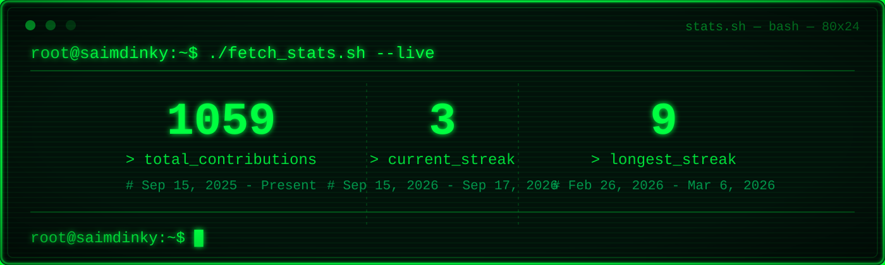

<!--
  DavidsDvm-style profile README, adapted for Rana Saim (saimdinky).
  Layout inspired by: https://github.com/DavidsDvm/DavidsDvm
-->

  

 
 

<h1 align="center"> Let's Connect </h1>

  
  &nbsp;
  
  &nbsp;
  
  &nbsp;
  
  &nbsp;
  

  

### 🧐 More About Me:
<table>
  <tr>
    <td valign="top">
      <ul>
        <li>🔭 I’m currently working on production SaaS backends and AI systems — RAG, MCP (FastMCP), and LangGraph agents</li>
        <li>🤝 I’m looking to collaborate on RAG pipelines, LLM agent workflows, and multi-tenant cloud-native APIs</li>
        <li>🌱 I’m currently learning deeper agent orchestration, hybrid retrieval, and MCP tool design</li>
        <li>👨🏻‍💻 Most of my projects are available on <a href="https://github.com/saimdinky?tab=repositories">Github</a></li>
        <li>💬 Ask me about Java Spring Boot, NestJS, FastAPI, multi-tenant architecture, AWS serverless, and shipping GenAI</li>
        <li>📫 Feel free to contact me on <a href="https://www.linkedin.com/in/saimdinky/">LinkedIn</a></li>
        <li>⚡ Fun fact: I’ve gone from large-scale Spring Boot ERPs to serverless finance platforms and LangGraph agents</li>
        <li>📝 Checkout my <a href="https://medium.com/@saimdinky">Medium</a></li>
      </ul>
    </td>
    <td valign="top" align="right">
      
    </td>
  </tr>
</table>

  

<h1 align="center"> Languages/Frameworks I'm good at: </h1>

  <code></code>
  <code></code>
  <code></code>
  <code></code>
  <code></code>
  <code></code>
  <code></code>
  <code></code>
  <code></code>
  <code></code>
  <code></code>
  <code></code>
  <code></code>
  <code></code>
  <code></code>

 

<h1 align="center"> Languages/Frameworks I'm learning: </h1>

  <code></code>
  <code></code>
  <code></code>
  <code></code>
  <code></code>

 

<h1 align="center"> Environments I work with: </h1>

  <code></code>
  <code></code>
  <code></code>
  <code></code>
  <code></code>
  <code></code>
  <code></code>

 

## 🔥 GitHub Stats 🔥

  

## 📘 My top open source projects

  
  

&#8192;

  
  

&#8192;

&#8192;

  

## 🐍 CONTRIBUTION SNAKE - WATCH IT DEVOUR MY COMMITS!

<picture>
  <source media="(prefers-color-scheme: dark)" srcset="https://raw.githubusercontent.com/saimdinky/saimdinky/output/github-contribution-grid-snake-dark.svg">
  <source media="(prefers-color-scheme: light)" srcset="https://raw.githubusercontent.com/saimdinky/saimdinky/output/github-contribution-grid-snake.svg">
  
</picture>

 

Last refresh: <b>Tuesday, September 1 at 2:18 PM GMT+5</b>
